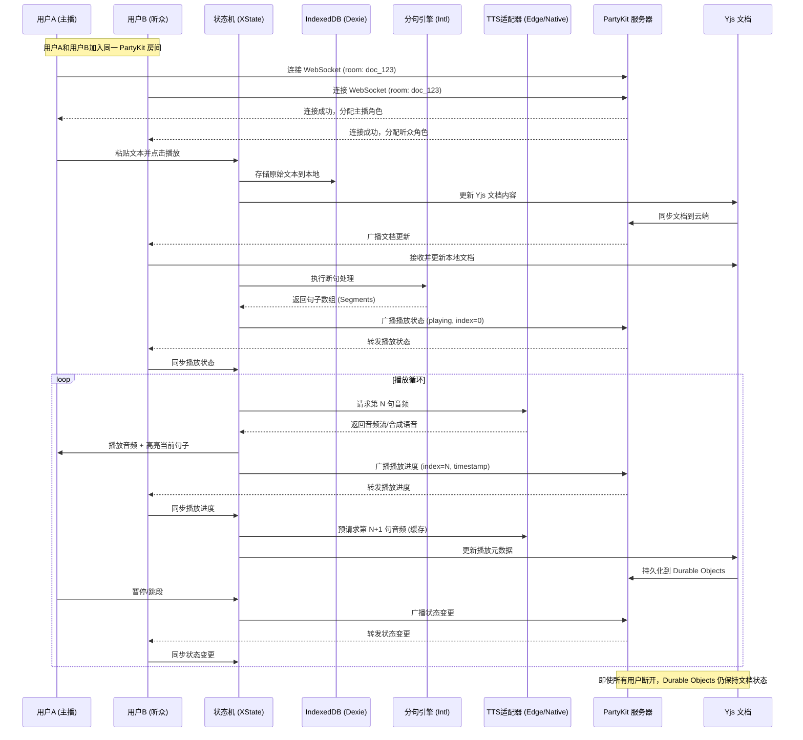

为了确保“粘贴即朗读”的 MVP 既能快速上线，又能避开常见的技术坑点（如长文本卡顿、浏览器内存泄露、语音中断等），我采用**逆向思维（从失败场景反推需求）**进行深度架构设计。

---

### 一、 逆向思维：为什么大多数 TTS 软件不好用？（痛点分析）

1.  **断句生硬**：直接把一万字塞给浏览器，它会卡死，或者读到一半断掉。
2.  **进度丢失**：刷新页面或浏览器崩溃，刚才粘贴的长文和读到的进度全没了。
3.  **声音机械**：原生 API 音质太差，听久了头疼。
4.  **无法后台**：手机浏览器切到后台，朗读立即停止。
5.  **音画不同步**：声音读到了第十句，屏幕还停留在第一句。

---

### 二、 MVP 技术架构设计文档

#### 1. 系统总体架构方案
采用**"生产者-消费者-协作"模型**。将文本处理（生产者）与音频播放（消费者）解耦，中间通过一个**逻辑缓冲区（Queue）**调度，并利用 **PartyKit** 实现实时协作和状态同步。

*   **核心技术栈**：
    *   **前端**：React + Tailwind CSS
    *   **状态机**：[XState](https://github.com/statelyai/xstate)（严谨控制：空闲 -> 解析中 -> 播放中 -> 暂停 -> 错误）
    *   **实时协作层**：[PartyKit](https://docs.partykit.io/)（基于 Cloudflare Durable Objects 的全局分布式实时服务器）
    *   **协作数据结构**：[Yjs](https://yjs.dev/) + [y-partykit](https://docs.partykit.io/reference/y-partykit-api/)（CRDT 实时协作）
    *   **存储**：[Dexie.js](https://github.com/dexie/Dexie.js) (IndexedDB 封装) + PartyKit Durable Objects 持久化
    *   **TTS 驱动**：混合模式（原生 Web Speech API + 远程 Edge-TTS 代理）
    *   **分句引擎**：`Intl.Segmenter` (浏览器原生高性能分词)

*   **PartyKit 集成优势**：
    *   **实时同步**：多用户可同时加入同一"房间"，实时同步播放进度、播放状态
    *   **协作编辑**：基于 Yjs 的 CRDT，支持多人同时编辑文本，冲突自动解决
    *   **全局分布式**：基于 Cloudflare 边缘网络，全球低延迟访问
    *   **状态持久化**：Durable Objects 保证房间状态永不丢失，即使所有用户断开连接
    *   **按需扩展**：每个文档独立 Party，轻量级启动，自动扩缩容

#### 2. 详细模块设计

##### A. 文本预处理层（The Producer）
不要直接处理原始文本。
*   **清理**：去除多余空格、乱码。
*   **智能切片**：使用 `Intl.Segmenter` 按句子（sentence）切分。
    *   *逆向考量*：防止单句过长。若单句超过 100 字，强制按逗号拆分，防止 TTS 引擎超时。
*   **持久化策略**：
    *   **本地缓存**：粘贴后立即存入 IndexedDB，快速恢复离线状态。
    *   **云端同步**：通过 PartyKit 的 Yjs provider 实时同步到云端，支持多设备访问。
    *   **房间隔离**：每个文档对应一个 Party Room ID（如 `doc_${documentId}`），保证状态隔离。

##### B. 调度与缓冲区（The Orchestrator）
*   **双指针管理**：
    *   `cursor_text`：当前渲染到的文字位置。
    *   `cursor_audio`：当前音频播放到的位置。
*   **预加载逻辑**：始终保持当前句子后 3 句的音频已进入缓存队列。
*   **实时同步机制**（新增）：
    *   **状态广播**：通过 PartyKit WebSocket 广播播放状态（playing/paused/stopped）、当前播放索引、播放时间戳。
    *   **冲突解决**：使用 XState 状态机 + PartyKit 消息队列，确保多用户操作的一致性。
    *   **主从模式**：第一个加入房间的用户成为"主播"，其他用户为"听众"，主播控制播放，听众实时同步。

##### C. 播放引擎层（The Consumer / TTS Adapter）
设计一个 `TTS_Provider` 接口，支持多引擎切换：
1.  **L1 引擎 (Web Speech)**：秒开，离线可用，用于快速反馈。
2.  **L2 引擎 (Edge-TTS)**：通过后端 Proxy 调用微软声音，音质极佳。
    *   *技术实现*：GitHub 开源项目 [edge-tts-vercel](https://github.com/skygongque/edge-tts-vercel)（可部署在 Vercel 上的 Serverless 函数）。

##### D. 实时协作层（The Collaborator - 新增）
*   **Yjs 文档同步**：
    *   使用 `y-partykit` provider 连接到 PartyKit 服务器。
    *   文本内容存储在 Yjs `Y.Text` 类型中，支持多人同时编辑。
    *   元数据（播放状态、当前索引）存储在 Yjs `Y.Map` 中。
*   **PartyKit 服务器端**：
    *   实现 `Party.Server` 接口，处理 WebSocket 连接。
    *   集成 `y-partykit` 的 `onConnect` 方法，提供 Yjs 后端服务。
    *   使用 `persist: { mode: "snapshot" }` 持久化文档状态到 Durable Objects。
*   **客户端连接**：
    *   使用 `YPartyKitProvider` 连接到 PartyKit 服务器。
    *   监听 Yjs 文档变化，实时更新 UI。
    *   监听其他用户的播放状态变化，自动同步本地播放器。

---

### 三、 核心逻辑流程图



---

### 四、 关键技术细节实现（可执行路径）

#### 1. 解决浏览器后台停止问题
*   **方案**：使用 **Web Wake Lock API**。
*   **代码思路**：当播放开始时，请求 `screen` 类型的锁，防止移动端设备进入休眠，从而维持浏览器的 JS 运行环境。
*   **PartyKit 增强**：即使浏览器进入后台，PartyKit WebSocket 连接仍保持活跃，当用户返回时可以快速同步最新状态。

#### 2. 解决长文本滚动定位（音画同步）
*   **方案**：**虚拟列表 + 引用映射**。
*   **代码思路**：
    *   给每一个分好的句子生成一个唯一的 `id` (例如 `sent_001`)。
    *   渲染时长列表使用虚拟滚动。
    *   当 TTS 回调 `onBoundary`（如果是原生 API）或音频播放到特定时间点时，通过 `scrollIntoView({ behavior: 'smooth' })` 将对应 ID 的 DOM 元素滚动到视口中央。
*   **PartyKit 同步**：通过 Yjs 的 `Y.Map` 存储当前高亮的句子 ID，所有客户端实时同步高亮位置。

#### 3. 性能优化：防内存溢出
*   **逆向思考**：如果用户粘贴了一本《三国演义》，直接渲染 10 万个 DOM 节点会卡死。
*   **执行策略**：
    *   **内存只存索引**：IndexedDB 存储全文，内存中只保留当前视图可见的约 50 个句子。
    *   **Audio Blob 及时释放**：使用 `URL.createObjectURL` 生成的音频链接，在播放完毕后必须立即调用 `URL.revokeObjectURL` 释放内存。
*   **PartyKit 优化**：
    *   **文档分片**：超大文档可按章节拆分为多个 Party Room，每个 Room 负责一个章节。
    *   **增量同步**：Yjs 的 CRDT 特性确保只同步变化的部分，而非整个文档。
    *   **智能预加载**：根据用户阅读速度预测，动态调整预加载策略。

#### 4. 多用户协作冲突解决（新增）
*   **场景**：多个用户同时编辑文本或控制播放。
*   **解决方案**：
    *   **文本编辑**：Yjs 的 CRDT 自动解决编辑冲突，保证最终一致性。
    *   **播放控制**：采用"主从模式"，只有主播可以控制播放，听众只能查看和跟随。
    *   **角色切换**：主播离开时，自动将控制权移交给下一个加入的用户。
*   **实现代码**：
    ```typescript
    // PartyKit 服务器端角色管理
    onConnect(conn) {
      const connections = this.room.getConnections();
      if (connections.length === 1) {
        conn.send(JSON.stringify({ type: 'role', role: 'host' }));
      } else {
        conn.send(JSON.stringify({ type: 'role', role: 'listener' }));
      }
    }
    ```

#### 5. 离线优先架构（新增）
*   **策略**：结合 IndexedDB 和 PartyKit，实现离线优先体验。
*   **实现**：
    *   **优先使用本地**：文本编辑和播放状态优先保存到 IndexedDB。
    *   **后台同步**：网络恢复后，自动将本地变更同步到 PartyKit。
    *   **冲突检测**：使用 Yjs 的版本向量检测离线期间的冲突，自动合并或提示用户。
*   **优势**：即使在弱网或离线环境下，用户仍可正常使用核心功能。

#### 6. 全局低延迟访问（新增）
*   **PartyKit 优势**：基于 Cloudflare 边缘网络，全球 200+ 数据中心。
*   **实现**：
    *   **智能路由**：PartyKit 自动将用户连接到最近的边缘节点。
    *   **状态迁移**：当用户地理位置变化时，Durable Objects 自动迁移到最近的节点。
*   **效果**：无论用户在哪个国家，都能享受 <50ms 的延迟。

---

### 五、 MVP 开发优先级 (Roadmap)

#### 第一周：基础通路 + PartyKit 集成
- [ ] 搭建 PartyKit 项目结构（server.ts, rooms.ts）
- [ ] 实现 Yjs + y-partykit 服务器端集成
- [ ] 实现 UI 粘贴框和基于 `Intl.Segmenter` 的文本显示
- [ ] 集成浏览器 Web Speech API 实现"点哪读哪"
- [ ] 使用 Zustand 记录当前播放句子的 Index
- [ ] 实现 PartyKit WebSocket 连接和基础消息广播
- [ ] 实现文档内容的 Yjs 同步

#### 第二周：体验升级 + 实时协作
- [ ] 部署 Edge-TTS 代理（使用 Vercel/Docker）
- [ ] 实现音频预加载队列（解决句子间的停顿感）
- [ ] 实现高亮跟随和自动滚动
- [ ] 实现多用户实时协作编辑（基于 Yjs CRDT）
- [ ] 实现播放状态的实时同步（主播/听众模式）
- [ ] 实现用户在线状态显示
- [ ] 实现 PartyKit Durable Objects 持久化

#### 第三周：稳定性增强 + 高级特性
- [ ] 加入 IndexedDB 自动保存进度
- [ ] 加入 Wake Lock 防止手机熄屏
- [ ] 增加语速、人声切换 UI
- [ ] 实现离线优先架构（IndexedDB + PartyKit 后台同步）
- [ ] 实现冲突检测和自动合并
- [ ] 优化长文本性能（虚拟滚动 + 文档分片）
- [ ] 实现跨设备同步（手机/电脑/平板）

#### 第四周：生产优化
- [ ] 性能测试和优化（内存、延迟、并发）
- [ ] 安全加固（房间访问控制、身份验证）
- [ ] 监控和日志（PartyKit 集成、错误追踪）
- [ ] 部署到生产环境（PartyKit 全球部署）
- [ ] 编写用户文档和开发者文档

### 六、 推荐 GitHub 开源组件清单

1.  **实时协作平台**: `partykit/partykit` (全局分布式实时服务器，基于 Cloudflare Durable Objects)
2.  **协作数据结构**: `yjs/yjs` + `partykit/y-partykit` (CRDT 实时协作，PartyKit 官方集成)
3.  **状态管理**: `xstate` (处理复杂的播放、加载、错误状态)
4.  **存储**: `dexie` (最快的 IndexedDB 封装，用于离线缓存)
5.  **TTS 代理后端**: `rany2/edge-tts` (Python) 或 `pipecat-ai/pipecat` (更前沿的实时流)
6.  **UI 库**: `shadcn/ui` (快速构建专业外观的播放控制器)
7.  **虚拟滚动**: `tanstack/react-virtual` (高性能长列表渲染)
8.  **客户端 SDK**: `partykit/client` (PartyKit 官方客户端 SDK)
9.  **React Hooks**: `partykit/react` (PartyKit React 集成，包含 usePartySocket 等 hooks)

### 七、 PartyKit 服务器端代码示例

#### 服务器端实现 (party/rooms.ts)
```typescript
import type * as Party from "partykit/server";
import { onConnect } from "y-partykit";

export default class TTSRoom implements Party.Server {
  constructor(readonly room: Party.Room) {}

  async onRequest(req: Party.Request) {
    if (req.method === "GET") {
      return new Response(JSON.stringify({
        room: this.room.id,
        connections: this.room.connections.size,
      }));
    }
    return new Response("Method not allowed", { status: 405 });
  }

  onConnect(conn: Party.Connection) {
    const connections = this.room.getConnections();
    const isFirstUser = connections.length === 0;
    
    conn.send(JSON.stringify({
      type: "role",
      role: isFirstUser ? "host" : "listener",
    }));

    return onConnect(conn, this.room, {
      persist: { mode: "snapshot" },
      callback: {
        async handler(yDoc) {
          const state = yDoc.getMap("state");
          const playbackState = {
            isPlaying: state.get("isPlaying") || false,
            currentIndex: state.get("currentIndex") || 0,
            timestamp: state.get("timestamp") || 0,
          };
          this.room.broadcast(JSON.stringify({
            type: "state",
            ...playbackState,
          }));
        },
        debounceWait: 1000,
      },
    });
  }
}

TTSRoom satisfies Party.Worker;
```

#### 客户端连接示例 (app/client.tsx)
```typescript
import YPartyKitProvider from "y-partykit/provider";
import * as Y from "yjs";
import { usePartySocket } from "partykit/react";

function TTSApp() {
  const yDoc = useMemo(() => new Y.Doc(), []);
  const provider = useMemo(
    () => new YPartyKitProvider(
      "localhost:1999",
      "doc_123",
      yDoc,
      {
        connect: true,
        params: { token: "auth-token" },
      }
    ),
    [yDoc]
  );

  const ws = usePartySocket({
    host: "localhost:1999",
    room: "doc_123",
    onMessage: (event) => {
      const data = JSON.parse(event.data);
      if (data.type === "role") {
        console.log("My role:", data.role);
      } else if (data.type === "state") {
        console.log("Playback state:", data);
      }
    },
  });

  return (
    <div>
      <textarea
        value={yDoc.getText("content").toString()}
        onChange={(e) => {
          yDoc.getText("content").delete(0, yDoc.getText("content").length);
          yDoc.getText("content").insert(0, e.target.value);
        }}
      />
    </div>
  );
}
```

这个架构在逆向上解决了"卡顿、丢失、难听"三大痛点，并利用 PartyKit 的实时协作能力，实现了多用户同步听书、协作编辑等创新功能，确保即使在弱网环境下，用户依然能有流畅的听书体验。